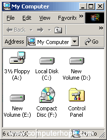
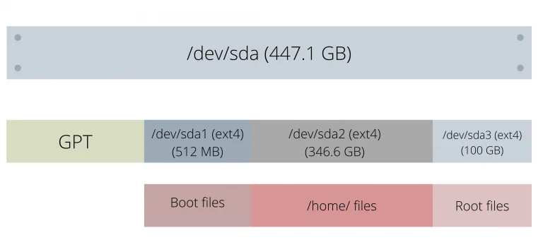

# 文件系统

* `/proc`: 查看手册 `man proc`。
* `/proc/self/exe`: 是指向当前进程的程序文件的软链接。
* `/proc/<pid>/exe`: 是指向进程`<pid>`的程序文件的软链接。

    [How to Find File System Names](https://docs.oracle.com/cd/E19455-01/805-7228/bkuptasks2-78540/index.html)


## 分区(Partition)和文件系统(Filesystem)

本小节内容来自 [参考链接](https://www.linuxfordevices.com/tutorials/linux/partitions-and-filesystems) 。

### 分区：

Linux上的分区指：存储设备中划分出来的一个片段，该片段与其他片段逻辑上分离，好比一个个独立的房间。

### 分区表(partition table)：

分区表存储各个分区的元数据，比如起始位置、终止位置、大小等。
有两种主要的分区表类型，MBR(older)和GPT(newer)：

| Partition tables           | Maximum primary partitions | Maximum size for each partition | Security                                                  | Operating system Support |
|----------------------------|----------------------------|---------------------------------|-----------------------------------------------------------|--------------------------|
| Master Boot Record (MBR)   | 4                          | 2TB                             | No such security features                                 | Supports most modern OS  |
| Guid Partition Table (GPT) | No such limit              | 18 Exabytes                     | CRC32 checksum mechanism to verify the integrity of files | Supports most modern OS  |

从上表可以很明显地看出，为什么GPT更推荐。

## 文件系统

文件系统是我们在每个分区中管理数据的方式。它负责索引、存储、检索、命名文件和维护文件的元数据（文件所有者、大小、权限等）。存储在分区中。

一个文件保存在多个连续的 **扇区（sector）** 中，现代每个扇区大约为4096字节。
文件系统负责组织哪些扇区准备好使用了、一个文件必须存储在哪个扇区、哪个扇区存储了什么文件。
如果没有这种组织，就无法无法检索任何文件，因为系统无法得知文件的位置（block，块）。

主要的文件系统分类：

* FAT

文件分配表（FAT，File Allocation Table）是Microsoft开发的第一个文件系统。
从1997发布之后，有多个版本，称为FAT12、FAT16、FAT32，连续地增加了最大支持文件大小（file size）和驱动器大小（drive size）。

FAT32允许的最大文件大小为4Gb。直至WindowsXP，FAT32是默认的文件系统，之后被NTFS取代。
虽然FAT非常基础，但是它支持几乎所有的设备和操作系统。

**注：** 驱动器（[drive](https://www.computerhope.com/jargon/d/drive.htm)），是一个能存储和读取非易失信息的位置，比如磁盘（disk）或光盘（disc）。

如下图，驱动器A:是一个软盘（[floppy drive](https://www.computerhope.com/jargon/f/fdd.htm)），
驱动器C:是主硬盘（primary hard drivce），
驱动器D:和E:是分区，F:是[CD-ROM](https://www.computerhope.com/jargon/c/cdrom.htm)。
CD-ROM常常是最后一个盘符（drive letter）。
在多数情况下，硬盘是C:驱动器，CD-ROM或其他光盘是D:驱动器。



* NTFS

新技术文件系统（New Technology File System，NTFS）是FAT的现代替代者。
除了支持高达16EB（大于170亿GB）的驱动器大小和256TB的单文件大小外，还支持日志系统（[journaling system](https://en.wikipedia.org/wiki/Journaling_file_system)）。

* ext/ext2/ext3/ext4

Linux的扩展文件系统（extended file system）或ext于1992年发布。之后有了3次更新：

ext2引入了文件属性（文件权限），ext3引入了日志功能（[journaling](https://en.wikipedia.org/wiki/Journaling_file_system)）。

ext4对ext2和ext3向后兼容，增加了存储限制和一些性能调整。
可以支持高达1EB的卷（volumn），单个文件可以达16TB。

ext4也引入了延迟内存分配的概念，即在文件被强制刷新到存储设备时才为其分配扇区。
这提高了CPU的性能并减少了坏的扇区。
今天几乎所有的现代Linux发行版都使用ext4作为默认的文件系统。

* ZFS

* Btrfs

### 总结

下图是一个分区和文件系统的层次结构示例：



我有一个500GB的SSD，分成3个分区（boot、home、root），使用GPT作为分区表。

我没有分出swap分区。所有的分区都跑在ext4文件系统上。

在一个双启动（dual-booted）存储设备（Windows和Linux）上，还有几个适用于Windwows的NTFS分区。

你可以使用以下命令在任意存储设备上查看分区：

```bash
lsblk
```

更多资源请访问：

* [How to install ZFS on Ubuntu – A Setup and Usage Guide](https://www.linuxfordevices.com/tutorials/ubuntu/install-zfs-on-ubuntu)
* [Ext4 vs Btrfs Filesystems – Which one should you choose?](https://www.linuxfordevices.com/tutorials/linux/ext4-vs-btrfs-filesystem)
* [How to install and format a partition with the Btrfs on Ubuntu?](https://www.linuxfordevices.com/tutorials/linux/btrfs-on-ubuntu)
* [Frequently Asked Questions regarding ext4](https://ext4.wiki.kernel.org/index.php/Frequently_Asked_Questions)

## 挂载

挂载：使设备上的文件和目录可以通过文件系统访问的一个过程。见[维基百科](https://zh.wikipedia.org/zh-cn/%E6%8C%82%E8%BD%BD)。

挂载点：A mount point is a location in the partition used as a root filesystem.

## 驱动


## 相关命令一览表

lsblk

    lsblk [options] [device...]

    list all avaivable or specified block devices.
    Reads the sysfs filesystem to gather information.

df

    df [OPTION]... [FILE]...

    report file system disk space usage on which each FILE resides.

    df -T 打印文件系统的类型。

du

    du [OPTION]... [FILE]...

    estimate file space usage.

quota

    quota -s -u user...

    display users' disk usage and limits.
    quota reports the quotas of all the filesystems listed in /etc/mtab.
    For filesystems that are NFS-mounted a call to the rpc.rquotad on the server machine is performed to get the information.

    -s, --human-readable

repquota

    prints a summary of disc usage and quotas for the specified file system.

mount
