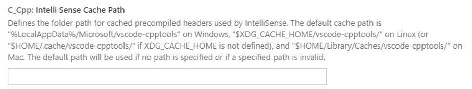

- .vscode-server/data/User/workspaceStorage/*：几十GB.
- .vscode-server：参考1
- .config: 可以针对每个目录找到相应的程序，比如 Chrome，然后有针对性地删除一些文件。参考[这里](https://stackoverflow.com/questions/58453967/vscode-remote-ssh-vscode-server-taking-up-a-lot-of-space)。
- .cache: 和 .config 类似处理，参考[这里](https://superuser.com/questions/366771/what-does-cache-do-it-consumes-a-huge-disk-space)。

    .cache/vscode-cpptools: This cache folder stores cached precompiled headers or "ipch" files that the IntelliSense engine uses to improve performance. You can limit the size of the cache by changing the setting value of C_Cpp.intelliSenseCacheSize. 参考[这里](https://github.com/microsoft/vscode-cpptools/issues/6594)：
    