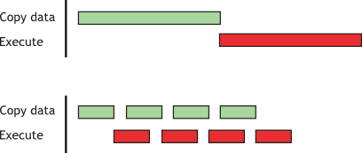

参见 [CUDA C Best Paratices Guide Reference](https://docs.nvidia.com/cuda/cuda-c-best-practices-guide/index.html)


# 9. 内存优化

## 9.1 主机与设备间数据传输

### 9.1.1 固定内存（Pinned Memory）

设备内存和GPU之间的峰值理论带宽要远远高于主机内存和设备内存之间的峰值理论带宽(例如，NVIDIA Tesla V100的峰值理论带宽为898 GB/s)(例如，PCIe x16 Gen3的峰值理论带宽为16 GB/s)。因此，为了获得最佳的整体应用程序性能，最小化主机和设备之间的数据传输是很重要的，即使这意味着在GPU上运行内核与在主机CPU上运行内核相比没有任何加速。

中间数据结构应该在设备内存中创建，由设备操作，并且在没有被主机映射或复制到主机内存的情况下销毁。

同样，由于与每次传输相关的开销，将许多小的传输批量成一个较大的传输比单独进行每个传输要好得多，即使这样做需要将内存的非连续区域打包到连续的缓冲区中，然后在传输之后解包 。

最后，当使用页面锁定(或固定)内存时，主机和设备之间可以实现更高的带宽，如CUDA c++编程指南和本文档的固定内存部分所述。

页面锁定或固定的内存传输可以在主机和设备之间实现最高的带宽。例如，在PCIe x16 Gen3卡上，固定内存可以达到大约12 GB/s的传输速率。

使用运行时API中的`cudaHostAlloc()`函数分配固定内存。bandwidthTest CUDA示例展示了如何使用这些函数以及如何测量内存传输性能。

对于已经预先分配的系统内存区域，可以使用`cudaHostRegister()`动态地固定内存，而不需要分配单独的缓冲区并将数据复制到其中。

固定内存不应该被过度使用。过度使用会降低整个系统的性能，因为固定内存是一种稀缺的资源，但是多少内存是太多很难提前知道。此外，与大多数正常的系统内存分配相比，系统内存的固定是一个重量级操作，因此，对于所有优化，都要测试应用程序和它所运行的系统，以获得最佳性能参数。

### 9.1.2 计算与内存传输的异步和重叠
使用cudaMemcpy()在主机和设备之间进行的数据传输阻止了传输。 也就是说，仅在数据传输完成后，控制权才返回给主机线程。 cudaMemcpyAsync()函数是cudaMemcpy()的非阻塞变体，在该变体中，控制权立即返回给主机线程。 与cudaMemcpy()相比，异步传输版本需要固定的主机内存（请参见固定的内存），并且它包含一个附加参数，即流ID。 流只是在设备上按顺序执行的一系列操作。 不同流中的操作可以交错，在某些情况下可以重叠-该属性可用于隐藏主机与设备之间的数据传输。

异步传输以两种不同的方式使数据传输与计算重叠。在所有支持cuda的设备上，可以通过异步数据传输和设备计算来重叠主机计算。例如，以下代码展示了在将数据传输到设备和执行使用设备的内核时，如何执行例程cpuFunction()中的主机计算。

```
// 重叠计算和数据传输
cudaMemcpyAsync(a_d, a_h, size, cudaMemcpyHostToDevice, 0);
kernel<<<grid, block>>>(a_d);
cpuFunction();
```

cudaMemcpyAsync()函数的最后一个参数是流ID，在本例中它使用默认的流，流0。
kernel也使用默认的流，直到内存拷贝完成才会开始执行;因此，不需要显式同步。
因为内存副本和内核都立即将控制权返回给主机，所以主机函数cpuFunction()会与它们的执行重叠。

上面代码中，内存复制和内核执行是顺序进行的。在能够并发复制和计算的设备上，可以通过主机和设备之间的数据传输来重叠设备上的内核执行。设备是否具有此功能由cudaDeviceProp结构的asyncEngineCount字段表示(或在设备设备CUDA示例的输出中列出)。在具有此功能的设备上，重叠再次需要固定的主机内存，此外，数据传输和内核必须使用不同的非默认流(具有非零流id的流)。这种重叠需要非默认流，因为使用默认流的内存复制、内存集函数和内核调用只有在设备上的所有前面调用(在任何流中)完成之后才会开始，而且在设备上的任何操作(在任何流中)在完成之前都不会开始。

```
// 并发复制和执行
cudaStreamCreate(&stream1);
cudaStreamCreate(&stream2);
cudaMemcpyAsync(a_d, a_h, size, cudaMemcpyHostToDevice, stream1);
kernel<<<grid, block, 0, stream2>>>(otherData_d);
```

在这段代码中，根据cudaMemcpyAsync调用的最后一个参数和内核的执行配置，创建并在数据传输和内核执行中使用两个流。

```
// 分阶段复制和执行（Staged concurrent copy and execute）
size=N*sizeof(float)/nStreams;
for (i=0; i<nStreams; i++) {
    offset = i*N/nStreams;
    cudaMemcpyAsync(a_d+offset, a_h+offset, size, dir, stream[i]);
    kernel<<<N/(nThreads*nStreams), nThreads, 0,  
             stream[i]>>>(a_d+offset);
}
```

这段代码假设N可以被nThreads * nStreams整除。因为流中的执行是顺序进行的，所以在它们各自的流中的数据传输完成之前，没有一个内核会启动。当前的gpu可以同时处理异步数据传输和执行内核。

*图1 内存复制和kernel执行的时间线比较*



>上方：顺序（Sequential）  
>下方：并发（Concurrent）


### 9.1.3 零拷贝内存（Zero Copy）
零拷贝是CUDA Toolkit v2.2及以上版本中增加的一个功能。它允许GPU线程直接访问主机内存。为此，它需要映射固定(非分页)内存。在集成的gpu上(即当CUDA设备属性结构的集成字段被设置为1)时，映射固定内存总是一个性能增益，因为它避免了多余的拷贝，因为集成的GPU和CPU内存在物理上是相同的。在独立的gpu上，映射固定内存只有在某些情况下才有优势。由于数据不是缓存在GPU上，映射的固定内存应该只被读写一次，读写内存的全局加载和存储应该被合并。零拷贝可以用来代替流，因为源于内核的数据传输会自动重叠内核执行，而无需设置和确定流的最佳数量。

```
// 零拷贝内存主机代码
float *a_h, *a_map;
...
cudaGetDeviceProperties(&prop, 0);
if (!prop.canMapHostMemory) 
    exit(0);
cudaSetDeviceFlags(cudaDeviceMapHost);
cudaHostAlloc(&a_h, nBytes, cudaHostAllocMapped);
cudaHostGetDevicePointer(&a_map, a_h, 0);
kernel<<<gridSize, blockSize>>>(a_map);
```

在这段代码中，`cudaGetDeviceProperties()`返回的结构的`canMapHostMemory`字段用于检查设备是否支持将主机内存映射到设备的地址空间。通过使用`cudaDeviceMapHost`调用`cudaSetDeviceFlags()`来启用页面锁定内存映射。注意，`cudaSetDeviceFlags()`必须在设置设备或进行需要状态的CUDA调用之前调用(本质上是在创建上下文之前)。使用`cudaHostAlloc()`分配页面锁定的映射主机内存，并通过函数`cudaHostGetDevicePointer()`获得指向映射设备地址空间的指针。在零拷贝主机代码中的代码中，kernel()可以使用指针`a_map`引用被映射的固定主机内存，这与a_map引用设备内存中的位置是完全一样的。

注意:映射固定主机内存允许CPU-GPU的内存传输与计算重叠，同时避免使用CUDA流。但是，由于对这些内存区域的任何重复访问都会导致CPU-GPU之间的重复传输，因此可以考虑在设备内存中创建第二个区域来手动缓存之前读取的主机内存数据。

## 9.2 设备内存空间

*图2 设备内存空间*


在这些不同的内存空间中，全局内存是最丰富的；  
全局、本地（Local）和纹理内存的访问延迟最大，其次是常量内存、共享内存和寄存器文件。  
**内存延迟：**Global > Local > Texture >> Constant > Shared > Register

设备中的GPU的计算能力可以通过编程来查询，如deviceQuery CUDA示例所示。该程序的输出如[图11](images/11.png)所示。该信息是通过调用cudaGetDeviceProperties()并访问它返回的结构中的信息获得的。
见 [CUDA Compute Capacity](https://docs.nvidia.com/cuda/cuda-c-best-practices-guide/index.html#cuda-compute-capability)。

*表9-1 设备内存的显著特征*

| Memory   | Location on/off chip | Cached | Access | Scope                | Lifetime        |
| -------- | -------------------- | ------ | ------ | -------------------- | --------------- |
| Register | On                   | n/a    | R/W    | 1 thread             | Thread          |
| Local    | Off                  | Yes†† | R/W    | 1 thread             | Thread          |
| Shared   | On                   | n/a    | R/W    | All threads in block | Block           |
| Global   | Off                  | †    | R/W    | All threads + host   | Host allocation |
| Constant | Off                  | Yes    | R      | All threads + host   | Host allocation |
| Texture  | Off                  | Yes    | R      | All threads + host   | Host allocation |

>† 在计算能力6.0和7.x的设备上默认缓存在L1和L2中；默认情况下，在计算能力较低的设备上，只在L2中缓存，但有些设备允许通过可选的编译标志在L1中进行缓存。

>†† 默认缓存在L1和L2中，但计算能力为5.x的设备除外；5.x计算能力仅在L2中缓存局部变量。

在纹理访问的情况下，如果一个纹理引用被绑定到全局内存中的一个线性数组，那么设备代码可以写入底层数组。
绑定到CUDA数组的纹理引用可以通过绑定一个表面到相同的底层CUDA数组存储的表面写入操作（surface-writes）写入到CUDA数组)。
应该避免在同一内核启动中从纹理读取数据同时写入其底层全局内存数组，因为纹理缓存是只读的，并且在修改关联的全局内存时不会失效。

### 9.2.1 全局内存的合并访问（Coalesced Access to Global Memory）
在对具有CUDA功能的GPU架构进行编程时，非常重要的性能考虑因素是合并全局内存访问。设备将warp的全局内存加载和存储合并到尽可能少的事务中。

计算能力6.0及以上，一个warp中的线程的并发访问将合并为多个事务，该事务数量等于为warp的所有线程提供服务所需的32字节事务（32-byte transactions）数。

**注意：**在计算能力为6.0或更高的设备上，默认设置为L1缓存，但是无论是否将全局负载缓存在L1中，数据访问单元均为32字节。

对于某些计算能力为3.5、3.7和5.2的设备，可以选择启用对全局内存的访问的L1缓存。 如果在这些设备上启用了L1缓存，则所需的事务数等于所需的128字节对齐段（128-byte aligned segments）的数目。

在具有GDDR内存的设备上，打开ECC时，以合并方式访问内存尤为重要。 分散的访问会增加ECC内存传输开销，尤其是在将数据写入全局内存时。

以下示例假定计算能力为6.0或更高，并且除非另有说明，否则访问针对4字节的字（4-byte words）。

#### 9.2.1.1 简单访问模式
第k个线程访问32字节对齐数组中的第k个字。

例如，如果warp的线程访问相邻的4字节字（4-byte words，例如，相邻的float值），则四个合并的32字节事务将为该内存访问提供服务。这种模式如图3所示。

*图3 合并访问*


>此访问模式导致四个32字节事务，用红色矩形表示。  
>warpSize * 4 bytes = 128 bytes，也就是说，一个warp中每个线程访问一个float，那么总共需要128 bytes，合并访问4次，每次32 bytes。

即使从四个32字节段中的任何一个中，只是请求单词的子集（例如，如果多个线程访问了同一个单词，或者某些线程未参与访问），都将获取完整的段。

此外，如果warp线程的访问已在四个段内或跨四个段进行了置换，那么具有6.0或更高计算能力的设备仍将仅执行四个32字节事务。

#### 9.2.1.2 顺序但未对齐的访问模式
如果warp中的顺序线程访问的是顺序但是没有以32字节段对齐的内存，那么将请求五个32字节段，如图4所示。

*图4 未对齐的顺序地址将导致五个32字节段* 


CUDA Runtime API的内存分配（例如通过`cudaMalloc()`）保证至少256-byte对齐。
因此，选择合适的thread-block大小，例如为warpSize的倍数，可以促进warp的内存访问被合适地对齐。

#### 9.2.1.3 未对齐访问的影响
```
// 一个复制功能的kernel，未对齐访问
__global__ void offsetCopy(float *odata, float* idata, int offset)
{
    int xid = blockIdx.x * blockDim.x + threadIdx.x + offset;
    odata[xid] = idata[xid];
}
```
这个kernel的功能是，从idata将数据复制到odata输出数组中，idata和odata数组都是位于全局内存中。
在主机中，kernel位于offset从0到32的一个循环中被调用执行（例如图4对应了这种未对齐）。图5展示了不同offset内存复制的有效带宽。

*图5 offsetCopy kernel的性能*


对于NVIDIA Tesla V100 ([compute capability](https://docs.nvidia.com/cuda/cuda-c-best-practices-guide/index.html#cuda-compute-capability) 7.0)，不带偏移量或偏移量为8个字的倍数的全局内存访问将导致四个32字节事务。达到的带宽约为790 GB / s。否则，每个warp将加载五个32字节的段，并且我们期望获得内存吞吐量大约为其无偏移量的4/5倍。

然而，在此特定示例中，吞吐量约为9/10，这是因为相邻的warp重新使用了其邻居获取的缓存行（cache line，计算能力3.x的缓存行大小为[128字节](https://docs.nvidia.com/cuda/cuda-c-programming-guide/index.html#global-memory-3-0)（其他设备没有提及），缓存位置为L1或L2）。

#### 9.2.1.4 跨步访问（Strided Accesses）
如上所示，在顺序访问未对齐的情况下，缓存有助于减轻性能影响。
但是，非单元跨步（non-unit-stride，即步长超过一个单元）访问可能有所不同，这是在处理多维数据或矩阵时经常发生的模式。因此，确保实际使用的每个高速缓存行中的数据尽可能多地被使用是这些设备上存储器访问性能优化的重要部分。

如下代码说明了跨步访问对有效带宽的影响，该复制将具有跨步元素的跨步数据从idata复制到odata。

```
// 非单元跨步数据拷贝
__global__ void strideCopy(float *odata, float* idata, int stride)
{
    int xid = (blockIdx.x*blockDim.x + threadIdx.x)*stride;
    odata[xid] = idata[xid];
}
```

图6说明了这种情况。在这种情况下，一个warp中的线程以2的步幅访问内存中的字。此操作导致Tesla V100（计算能力7.0）上每个warp加载八个L2缓存段。

*图6 相邻线程以2的步长访问内存*


跨度为2导致加载/存储效率（load / store efficiency）为50％，这是因为事务中有一半的元素没有使用，浪费了带宽。因为一次内存事务将为warp内的线程读取128字节（32 threads * 4 bytes）数据，但是warp内的线程却只得到了所需数据的一半，所以一个warp需要两次访存事务。  
*注：load / store一般是针对内存和寄存器之间，内存->寄存器为load，寄存器->内存为store.*  
随着步幅的增加，有效带宽减小，直到为一个warp中的32个线程加载32个32个字节的段的点为止，如图7所示。

*图7 strideCopy kernel的性能*


如图7所示，非单元跨步的全局内存访问任何时候都应该避免。
一种避免方式就是使用共享内存。

[**全局内存合并访问代码示例：**](http://cuda-programming.blogspot.com/2013/02/bank-conflicts-in-shared-memory-in-cuda.html)

假设有一个3x4矩阵（int）
```
0 1 2 3
4 5 6 7
8 9 a b
```
实际内存格局为一维的：
```
0 1 2 3 4 5 6 7 8 9 a b
```
你有4个线程，那么有以下两种访问方式：
```
// 方式一
thread 0:  0, 1, 2
thread 1:  3, 4, 5
thread 2:  6, 7, 8
thread 3:  9, a, b

// 方式二
thread 0:  0, 4, 8
thread 1:  1, 5, 9
thread 2:  2, 6, a
thread 3:  3, 7, b
```
方式一：线程第一次访问的分别是`0, 3, 6, 9`，不连续，所以没有被合并访问；  
方式二：线程第一次访问的分别是`0, 1, 2, 3`，连续，于是被合并访问。

##### *全局内存合并访问的附加说明：*

**结构体**：

[对齐要求](https://docs.nvidia.com/cuda/cuda-c-programming-guide/index.html#device-memory-accesses)

可以使用__alignof()等进行对齐。

```
struct __align__(16) {
    float x;
    float y;
};
```

**1D全局内存**：

对于1D的全局内存访问模式是，线程为ID为tid的每个线程访问位于地址BaseAddress（类型为type\*）上的数组的一个元素，使用以下地址：  
`BaseAddress + tid`  
为合并访问，type必须满足上述大小和对齐要求。

**2D全局内存**：

对于  
`BaseAddress + width * ty + tx`  
block的宽度和width都必须为warpSize的倍数（如果是半个warp调度，则是half-warp大小的倍数）。

`cudaMallocPitch()`和`cuMemAllocPitch()`以及相关的内存复制函数可以编写不依赖硬件的代码来符合内存的对齐和合并访问的约束的代码。


### 9.2.2 共享内存（Shared Memory）
[L1 / shared memory：延迟10 ~ 20 cycles](https://www.sciencedirect.com/topics/computer-science/l1-cache)  
由于共享内存是片上的，因此与本地和全局内存相比，共享内存具有更高的带宽和更低的延迟——前提是线程之间不存在存储体冲突。  
共享内存分配有静态和动态方式，动态分配方式为`kernel<<<Dg,Db,Ns,S>>>`，第三个参数为动态内存字节数。

#### 9.2.2.1 共享内存和存储体（Shared Memory and Memory Banks）
为了获得用于并发访问的高内存带宽，共享内存被分为大小相等且可以同时访问的内存模块（存储体，`banks`）。

为了获得用于并发访问的高内存带宽，共享内存被分为大小相等且可以同时访问的内存模块（存储体）。
因此，跨越n个不同存储体的n个地址的任何内存加载/存储（load / store）可以同时处理，有效带宽是单个存储体带宽的n倍。

但是，*如果一个内存请求的多个不同地址映射到相同的存储体，则访问将被序列化*——**存储体冲突（[`Bank conflicts`](https://docs.nvidia.com/cuda/cuda-c-programming-guide/index.html#shared-memory-5-x)）**。
硬件将具有存储体冲突的内存请求拆分为尽可能多的单独的无冲突请求，从而将有效带宽减少等于单独的内存请求数量的因数。
这里的一个例外是，当线程束中的多个线程寻址同一共享内存位置时，会导致广播。在这种情况下，来自不同存储体的多个广播将合并为从请求的共享内存位置到线程的单个多播。

在5.x或更高版本的计算能力的设备上，每个时钟周期，每个bank都有32位（32-bit）的带宽，并且将连续的32位字（32-bit words）分配给连续的存储体。
warp大小为32个线程，并且bank数量也为32，因此在warp中的任何线程之间都可能发生bank conflicts.

共享内存具有32个存储体，这些存储体组织为连续的32位字映射到连续的存储体。每个存储体每个时钟周期具有32位的带宽。  
参见 [H.4.3 Shared Memory](https://docs.nvidia.com/cuda/cuda-c-programming-guide/index.html#shared-memory-5-x)

**TODO：**bank到底是什么？是专门的硬件吗？64 KB的共享内存，却只有32-bit * 32的bank，bank是怎么读写共享内存呢？访问double类型时，bank只能存放16个数据，那么一个warp的32个线程怎么访问32个数据呢？分两次吗？

**补充：**在3.x及以上计算能力，没有bank conflict的查看工具。因为这些计算能力之后，驻留的warps更多，没有冲突的共享内存访问可能被合并，如此，bank conflict变得不再重要。

存储体可以使用[`cudaDeviceSetSharedMemConfig()`](https://docs.nvidia.com/cuda/cuda-runtime-api/group__CUDART__DEVICE.html#group__CUDART__DEVICE_1ga4f3f8a422968f9524012f43ba852058)函数设置为4字节、8字节，默认为4字节。
（共享内存配置见 [cudaSharedMemConfig](https://docs.nvidia.com/cuda/cuda-runtime-api/group__CUDART__TYPES.html#group__CUDART__TYPES_1g6e62d15f3c224625e8c9aa946f1709a6)）。


[**Bank Conflicts代码示例：**](http://cuda-programming.blogspot.com/2013/02/bank-conflicts-in-shared-memory-in-cuda.html)


[Bank Conflicts参考博客1](https://blog.csdn.net/Bruce_0712/article/details/65447608)  

### 9.2.3 本地 / 局部内存（Local Memory）
*本地内存之所以如此命名，是因为它的作用域是线程的本地，而不是因为它的物理位置。*事实上，本地内存是芯片外的。因此，访问本地内存与访问全局内存一样昂贵。换句话说，名称中的术语local并不意味着更快的访问。

本地内存只用于保存自动变量。这是在nvcc编译器发现没有足够空间的寄存器存放自动变量时决定的。很可能放在本地内存中的自动变量是占用太多寄存器空间的大型结构或数组，编译器确定的数组可能会被动态索引。

本地内存是抽象内存类型。它本身不是一个单独的存储器系统，而是一个用于保存溢出寄存器的存储器位置。当线程块需要比SM上更多的寄存器存储时，就会发生寄存器溢出。 Fermi之前的GPU将寄存器溢出到全局内存中，这导致应用程序性能急剧下降。 Compute 2.0和更高版本的设备将寄存器溢出到L1缓存中，从而最大程度地减少了寄存器溢出对性能的影响。

检查PTX汇编代码(通过使用`-ptx`或`nvcc`的`-keep`命令行选项编译获得)，可以发现在第一个编译阶段是否将变量放在了本地内存中。如果是，将使用`.local`助记符声明它，并使用`ld.local`和`st.local`助记符访问它。如果没有，当后续的编译阶段发现该变量占用了目标体系结构太多的寄存器空间，可能仍然会做出不同的决定。没有办法对特定的变量进行检查，但是编译器在使用`——ptxas-options=-v`选项运行时，会报告每个内核的本地内存使用总量(lmem)。


### 9.2.4 纹理内存（Texture Memory）
纹理和表面内存（Texture and Surface Memory）驻留在设备内存（device memory），并且被纹理缓存区缓存（texture cache）。  参见 \[[CUDA C Programming Guide: 5.3.2. Device Memory Accesses](https://docs.nvidia.com/cuda/cuda-c-programming-guide/index.html#device-memory-accesses)\]

因此，纹理获取只会在缓存未命中（cache miss）时，消耗一次设备内存读操作，之后它只需要从纹理缓存（texture cache）中读取。

纹理缓存针对2D空间局部性进行了优化，因此，同一个warp中读纹理地址在一起的线程将获得最佳性能。

纹理内存被设计成流式读取，并且是常数时间延迟。也就是说，缓存命中降低了DRAM的带宽要求，却没有读取延迟。

纹理内存是只读的。


### 9.2.5 常量内存（Constant Memory）
常量内存空间驻留在设备内存中，并缓存在常量缓存（constant cache）中。

在一个设备上总共有64 KB的常量内存。常量内存空间会被缓存。

*warp内的线程对不同地址的访问是串行化的，因此访存成本与warp内所有线程读取的不同地址的数量成线性关系。*

因此，当同一warp中的线程只访问几个不同的位置时，常量缓存是最好的。如果所有的线程都访问同一个位置，那么常量内存的访问速度可以和寄存器访问速度一样快。


[内存分配方式](https://docs.nvidia.com/cuda/cuda-c-programming-guide/index.html#variable-memory-space-specifiers)

[kernel执行方式：](https://docs.nvidia.com/cuda/cuda-c-programming-guide/index.html#execution-configuration)  
形如`kernelFunc<<< Dg, Db, Ns, S >>>(params...)`，其中  
`Dg`：`dim3`类型，指定grid维度，即`Dg.x * Dg.y * Dg.z`;  
`Db`：`dim3`类型，指定block维度，即`Db.x * Db.y * Db.`;  
`Ns`：`size_t`类型，为动态分配共享内存的字节数（附加到静态分配的共享内存上）；动态分配的内存由声明为`__shared__`的外部（extern）数组的任何变量使用; Ns为可选参数，默认为0;    
`S`：`cudaStream_t`类型，指定关联的流；S为可选参数，默认为0（NULL流）。
