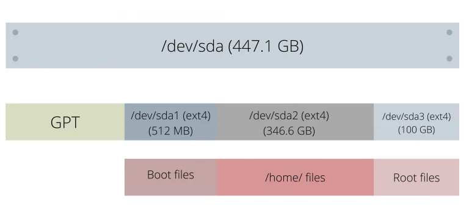

# 文件系统

* `/proc`: 查看手册 `man proc`。

## 分区(Partition)和文件系统(Filesystem)

本小节内容来自 [参考链接](https://www.linuxfordevices.com/tutorials/linux/partitions-and-filesystems) 。

### 分区：

Linux上的分区指：存储设备中划分出来的一个片段，该片段与其他片段逻辑上分离，好比一个个独立的房间。

### 分区表(partition table)：

分区表存储各个分区的元数据，比如起始位置、终止位置、大小等。
有两种主要的分区表类型，MBR(older)和GPT(newer)：

| Partition tables           | Maximum primary partitions | Maximum size for each partition | Security                                                  | Operating system Support |
|----------------------------|----------------------------|---------------------------------|-----------------------------------------------------------|--------------------------|
| Master Boot Record (MBR)   | 4                          | 2TB                             | No such security features                                 | Supports most modern OS  |
| Guid Partition Table (GPT) | No such limit              | 18 Exabytes                     | CRC32 checksum mechanism to verify the integrity of files | Supports most modern OS  |

从上表可以很明显地看出，为什么GPT更推荐。

## 文件系统

文件系统是我们在每个分区中管理数据的方式。它负责索引、存储、检索、命名文件和维护文件的元数据（文件所有者、大小、权限等）。存储在分区中。

一个文件保存在多个连续的**扇区（sector）**中，现代每个扇区大约为4096字节。
文件系统负责组织哪些扇区准备好使用了、一个文件必须存储在哪个扇区、哪个扇区存储了什么文件。
如果没有这种组织，就无法无法检索任何文件，因为系统无法得知文件的位置（block，块）。

主要的文件系统分类：

* FAT

* NTFS

* ext/ext2/ext3/ext4

* ZFS

* Btrfs

### 总结

下图是一个分区和文件系统的层次结构示例：

## 挂载
## 驱动

